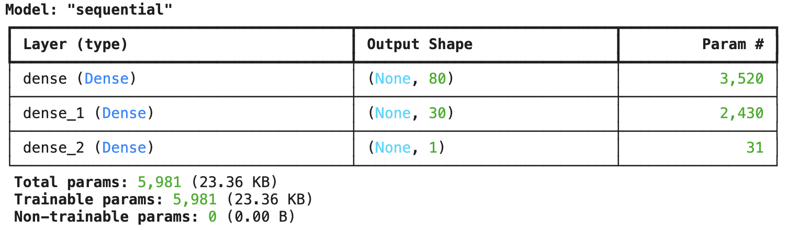
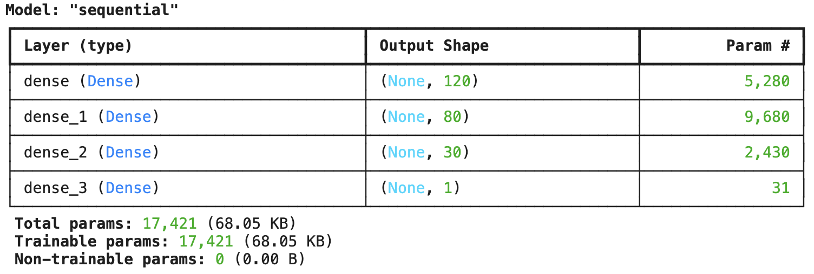
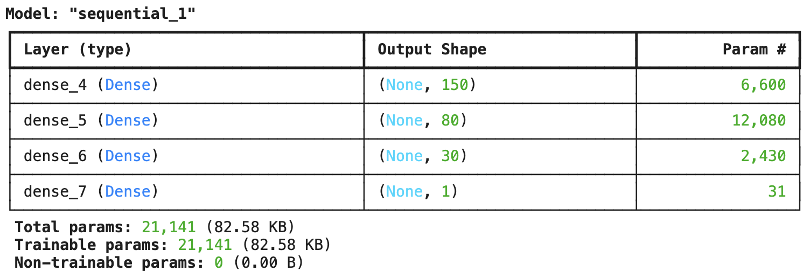
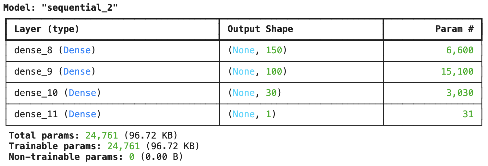

# deep-learning-challenge

## Setup and Usage
1. Clone this repository to your local machine using `git clone`.
2. To run the initial model, create a new notebook on [Google Colab](https://colab.research.google.com/) then upload the Jupyter Notebook `AlphabetSoupCharity.ipynb` from your local repository.
3. To run the model optimization steps, create a new notebook on Google Colab and upload `AlphabetSoupCharity_Optimization.ipynb` from your local repository.
4. Run each cell sequentially to load the data, preprocess the data, create and train the model, test it, evaluate its performance, and download the saved model files to your local machine.

## Overview of the Analysis
The purpose of this analysis is to build a neural network model to predict whether applicants funded by the nonprofit foundation Alphabet Soup will be successful based on a range of features.

The `charity_data.csv` contains over 34,000 organizations that have been funded by Alphabet Soup, with columns as follows:

* EIN and NAME — Identifications
* APPLICATION_TYPE — Alphabet Soup application type
* AFFILIATION — Affiliated sector of industry
* CLASSIFICATION — Government organization classification
* USE_CASE — Use case for funding
* ORGANIZATION — Organization type
* STATUS — Active status
* INCOME_AMT — Income classification
* SPECIAL_CONSIDERATIONS — Special considerations for application
* ASK_AMT — Funding amount requested
* IS_SUCCESSFUL — Was the money used effectively

## Results

### Data Preprocessing
* Target Variable: The `IS_SUCCESSFUL` column, which indicates whether the organization that received funding was successful.
* Feature Variables: Other features like sector of industry, organization type, income classification, funding amount and more.
* Variables Removed: The `EIN` and `NAME` columns were removed because they do not contribute to the model prediction.

### Compiling, Training, and Evaluating the Model
How many neurons, layers, and activation functions did you select for your neural network model, and why? 
Were you able to achieve the target model performance? 
What steps did you take in your attempts to increase model performance?

#### Neural Network Model
* Consists of 3 layers, with 80, 30, and 1 neuron(s) respectively.

#### Optimization 1
* 

#### Optimization 2
* 

#### Optimization 3
* 

## Summary
Summarize the overall results of the deep learning model. Include a recommendation for how a different model could solve this classification problem, and then explain your recommendation.
